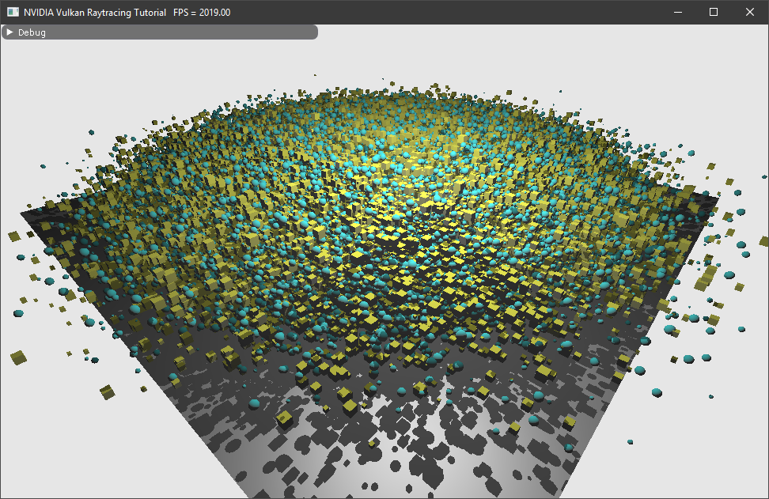

[Click here for the blog](https://nvpro-samples.github.io/)

# NVIDIA Vulkan Ray Tracing Tutorials

The focus of this project and the provided code is to showcase a basic integration of
ray tracing within an existing Vulkan sample, using the
[`VK_NV_ray_tracing`](https://www.khronos.org/registry/vulkan/specs/1.1-extensions/html/vkspec.html#VK_NV_ray_tracing) extension.
The following tutorials starts from a the end of the previous ray tracing tutorial and provides step-by-step instructions to modify and add methods and functions.
The sections are organized by components, with subsections identifying the modified functions.

This project contains multiple tutorials all around Vulkan ray tracing.

Instead of having examples fully functional, those tutorial starts from a program and guide the user to add what is necessary.

## Ray Tracing Tutorial

The first tutorial is starting from a Vulkan code example, which can load multiple OBJ and render them using the rasterizer, and adds step-by-step what is require to do ray tracing.

Jump to the [tutorial](ray_tracing__simple)

# Going Further

From this point on, you can continue creating your own ray types and shaders, and experiment with more advanced ray tracing based algorithms.

## [Jitter Camera (Anti-Aliasing)](ray_tracing_jitter_cam)

Anti-aliases the image by accumulating small variations of rays over time.

## [Handle Thousands of Objects](ray_tracing_instances)

The current example allocates memory for each object, each of which has several buffers.
This shows how to get around Vulkan's limits on the total number of memory allocations by using a memory allocator.

## [Any Hit Shader (Transparency)](ray_tracing_anyhit)

Implements transparent materials by adding a new shader to the Hit group and using the material
information to discard hits over time.

## [Reflections](ray_tracing_reflections)

Reflections can be implemented by shooting new rays from the closest hit shader, or by iteratively shooting them from the raygen shader. This example shows the limitations and differences of these implementations.

## [Many Hits and Shader Records](ray_tracing_manyhits)

Explains how to add more closest hit shaders, choose which instance uses which shader, and add data per SBT that can be retrieved in the shader, and more.

## [Animation](ray_tracing_animation)

This tutorial shows how animating the transformation matrices of the instances (TLAS) and animating the vertices of an object (BLAS) in a compute shader, could be done.

## [Intersection Shader](ray_tracing_intersection)

Adding thousands of implicit primitives and using an intersection shader to render spheres and cubes. The tutorial explains what is needed to get procedural hit group working.

----

Other tutorials are in progress and links will be available in the future.

* Callable shaders
